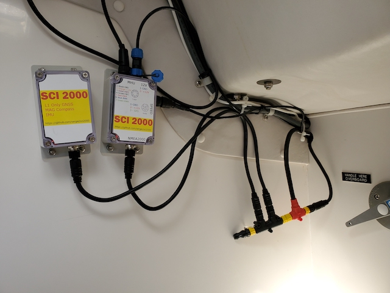
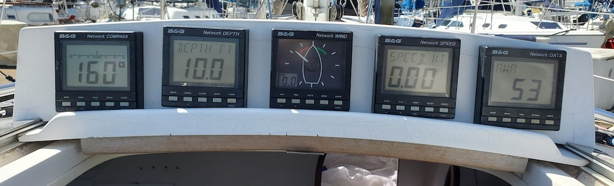
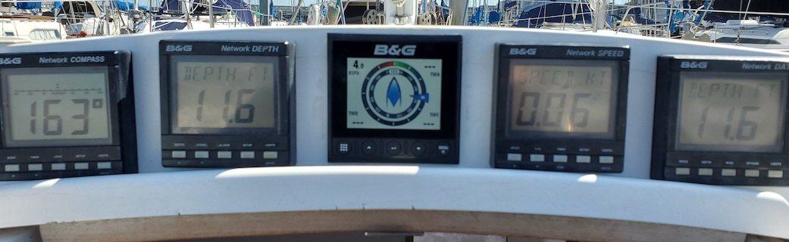

# Javelin instruments SW and HW

## Motivation

Javelin is equipped with B&G NET instruments and autopilot. The setup is almost 20 years old and gradually falls apart.
I already replaced two wind display units (servo motor failure), but it's getting more and more difficult find them on eBay.
Also the connectors and cables are getting old, rusty and brittle. On top of that all the instruments in B&G NET are connected in series, so if one of them fails, the whole network is down.

To have all instruments to replaced at once is quite costly, so I decided to do it gradually.

## Implementation

The first step was to build the adapters that will convert analog signals from the wind sensors and boat speed sensors to NMEA 2000.
I found the ESP32 NMEA200 kit sold by [Hat Labs](https://hatlabs.fi/)  and decided to use it as a base for my project.
This kit allows you to bring the multiple analog and digital inputs has N2K controller and very good power supply.

I got two of these kits. One for the Mast Head Unit and Paddle Wheel Sensors and another one for GPS, Compass and IMU.

- Mast Head Unit and Paddle Wheel N2K converter is described [here](mhu2nmea/README.md)
- GPS, Compass and IMU N2K converter is described [here](imu2nmea/README.md)

## Installation

### Two converters installed on the boat.

### B&G Triton dispaly installed
#### Before

#### After

