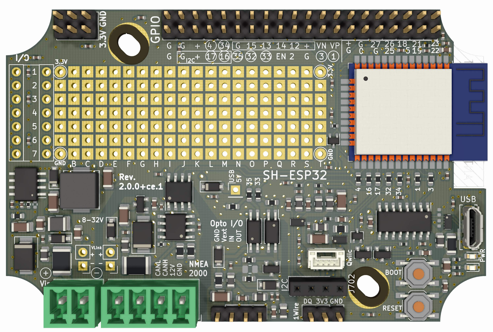
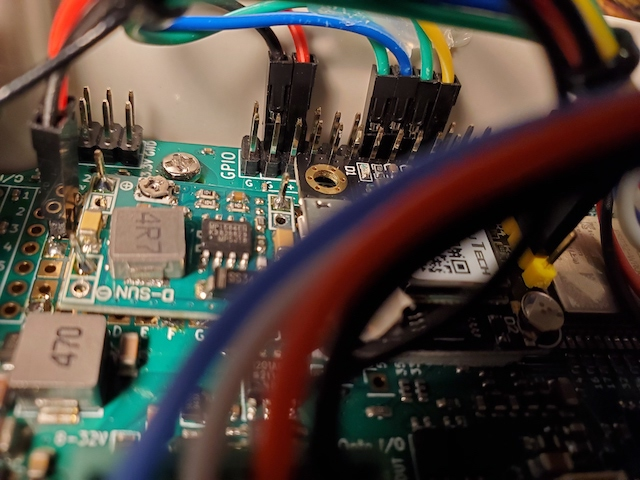

# ESP32 project for GPS and IMU sensor to N2K gateway

## Hardware 

* The [Sailor HAT](https://docs.hatlabs.fi/sh-esp32/) board is used to run this SW

* The GPS Module GPS NEO-6M is connected to the ESP32 UART module using following pins
  * RX - GPIO 15 of ESP32
  * TX - GPIO 13 of ESP32
  * VCC - ESP32 3.3V
  * GND - ESP32 GND
* The IMU Module HWT905-TTL is connected to the ESP32 UART module using following pins
  * RX (green)  - GPIO 14 of ESP32
  * TX (yellow) - GPIO 12 of ESP32
  * VCC (5V)    - + 5V of 12V to 5V converter 
  * GND - ESP32 GND

## Software

### How to build and flash
The CLion instructions are taken from this [page](https://www.jetbrains.com/help/clion/esp-idf.html)
* To build the image select "app" in configuration drop box and Click build  Cmd-F9
* To flash the image select "flash" in configuration drop box and Click build  Cmd-F9
* To monitor serial output the image select "monitor" in configuration drop box and Click build  Cmd-F9
   * To select the serial port go to CLion->Preferences (Cmd-,) then CMake Environment and put there ESPPORT=/dev/tty.usbserial-14130 or whatever serial port you have

### NMEA 2000
  The NMEA 2000 sender is done in the (N2KHandler)[main/N2KHandler.h] class. It has its own task where it sends the wind PGN periodically

All classes communicate through the queue. The queue is polled in the (main)[main/imu2nmea_main.cpp] function and data dispatched from there. 
