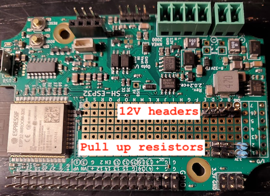
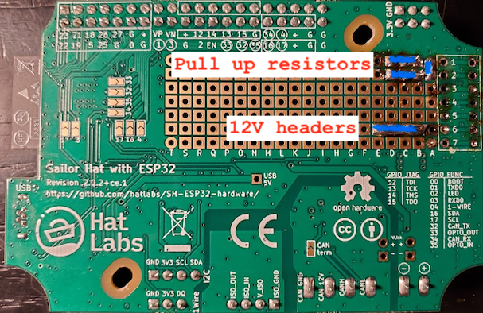
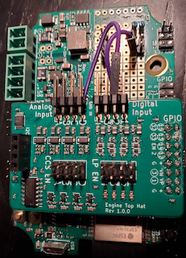
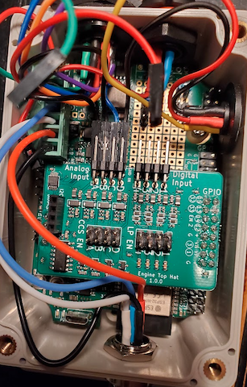
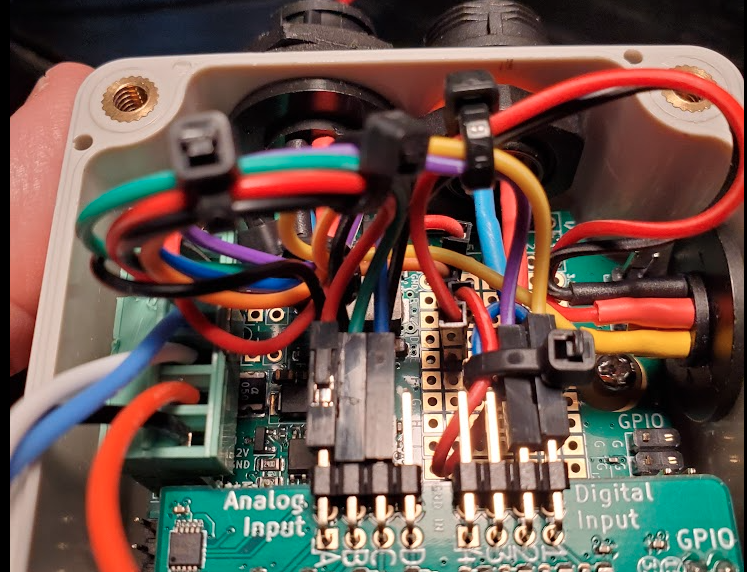
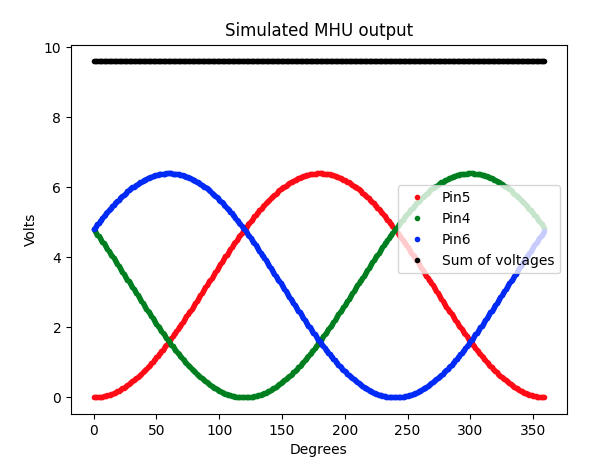

# ESP32 project for MHU analog sensors to N2K gateway

## Hardware 

* The [Sailor HAT](https://docs.hatlabs.fi/sh-esp32/) board is used to run this SW
* The daugther card of Sailor HAT  [Engine Hat](https://docs.hatlabs.fi/sh-esp32/pages/add-ons/engine-hat/) is used to connect the analog sensors to the ESP32
* The [MHU analog outputs](doc/B&G FAQ-MHU Wiring and Tests.pdf) is connected to the following pins
  * Wind Angle Phase (Red) - Analog input A  of Engine Hat  - CH0 of AD115 ADC
  * Wind Angle Phase (Green) - Analog input B of Engine Hat - CH1 of AD115 ADC
  * Wind Angle Phase (Blue) - Analog input C of Engine Hat  - CH2 of AD115 ADC
  * Wind Speed Signal (Violet) -  Digital input 2 of Engine Hat  - GPIO 13 of ESP32 
    * There is 20K pull up resistor connected to the input.
* The paddlewheel speed sensor is connected to the following pins
  * Speed Signal (Green) - Digital input 1 of Engine Hat  - GPIO 15 of ESP32 
    * There is 20K pull up resistor installed on board, but not connected to the input. Need to check if it's needed. 

### Connectors

#### Power connector 
  1 - GND (Blue)
  2 - +12 V (Red)

### Paddle wheel water speed sensor connector
  1 - GND  (Blue)
  2 - +12 V (Red)
  3 - Speed pulse (Green)
  4..6 N/C

### Wind sensor connector
  1 - GND (Black)
  2 - +12 V (Orange) 
  3 - Speed pulse (Purple)      
  4 - N/C
  5 - Wind angle phase (red)
  6 - Wind angle phase (blue)
  7 - Wind angle phase (green)

## View of the assembly 
### Top of the Sailor HAT

### Bottom of the Sailor HAT

### Pullup connected

### Ground and power connected

### All connected

### Box labels 
[labels.svg](../labels.svg)

## Software 

### How to build and flash
The CLion instructions are taken from this [page](https://www.jetbrains.com/help/clion/esp-idf.html)
* To build the image select "app" in configuration drop box and Click build  Cmd-F9
* To flash the image select "flash" in configuration drop box and Click build  Cmd-F9
* To monitor serial output the image select "monitor" in configuration drop box and Click build  Cmd-F9
  * To select the serial port go to CLion->Preferences (Cmd-,) then CMake Environment and put there ESPPORT=/dev/tty.usbserial-14130 or whatever serial port you have

### The AWA 
#### AWA Encoding
The AWA is encoded as three sinusoidal signals with 120 degrees phase shift between them.
The algorithm to decode angle from the voltages on three wires is prototyped in this [script](scripts/awa_decoder.py)
The algorithm is not sensitive to the absolute values of the voltages, since their sum is supposed to be constant.

#### AWA Decoding
  The AWA inputs are connected to  [AD115 ADC](doc/ads1115.pdf) the I2C address is set to 0x4b (default on Top Hat)
  The software to read this input is implemented by the class [AWAHandler](main/AWAHandler.h) it has its own task and polls ADC periodically
  The ADC doesn't allow to latch all three inputs simultaneously, so change of angle between readings introduces some error.

### The AWS 
### AWS encoding
  The AWS is encoded as a pulse train with frequency proportional to the wind speed. 
### AWS decoding
  To read the AWS value we use the pulse counter feature of ESP32 the code is implemented in (CNTHandler)[main/CNTHandler.h] class.
  The interrupt is set to generate for every four pulses, that should increase the accuracy I hope.

### The SOW
### SOW encoding
The SOW is encoded as a pulse train with frequency proportional to the wind speed.
### SOW decoding
To read the SOW value we use the pulse counter feature of ESP32 the code is implemented in (CNTHandler)[main/CNTHandler.h] class.
The interrupt is set to generate for every four pulses, that should increase the accuracy I hope.

### NMEA 2000
  The NMEA 2000 sender is done in the (N2KHandler)[main/N2KHandler.h] class. It has its own task where it sends the wind PGN periodically

All classes communicate through the queue. The queue is polled in the (main)[main/mhu2nmea_main.cpp] function and data dispatched from there. 
